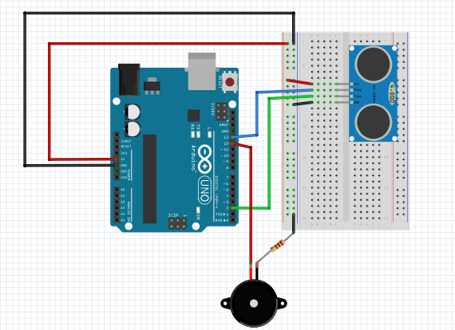

# Door Contact Sensor
A simple sensor based on the ATmega328P that makes a ringing sound effect each time a door or window opens. The HC-SR04 sensor produces sound waves that reflect on the door surface. When a sound wave is produced, the microcontroller starts a timer and an interrupt occurs if the sensor receives the wave back. 

# Schematic
We will need :
- ATmega328P 
- HC-SR04 ultrasonic distance sensor
- Buzzer
- 100 Ω Resistor



# Upload
Check if the Arduino is plugged in the USB port specified in the Makefile.
```shell 
$ make build
$ make burn
``` 
